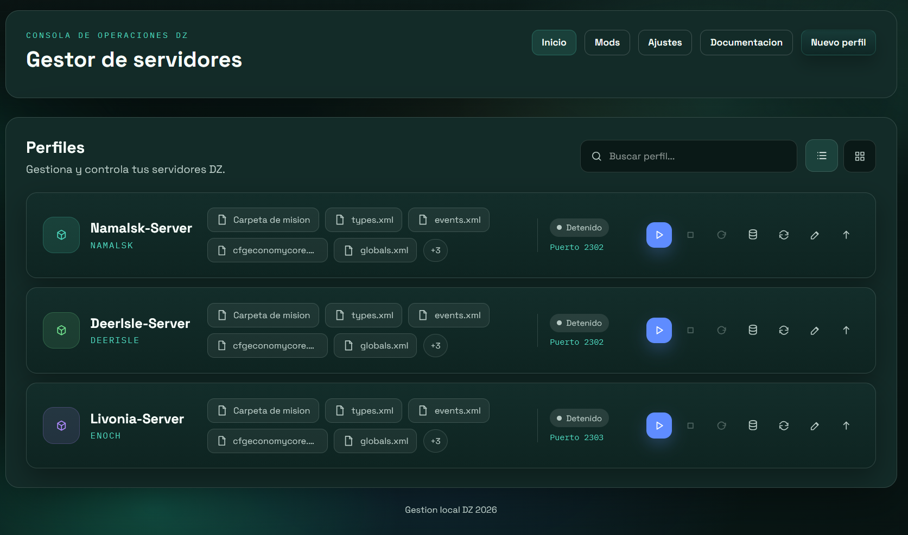
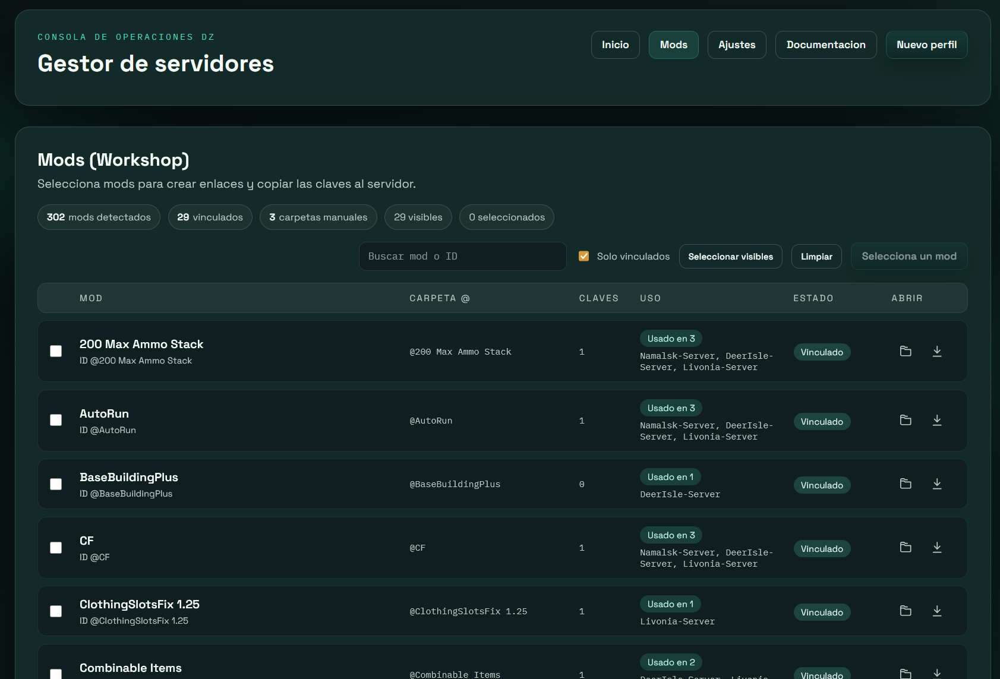
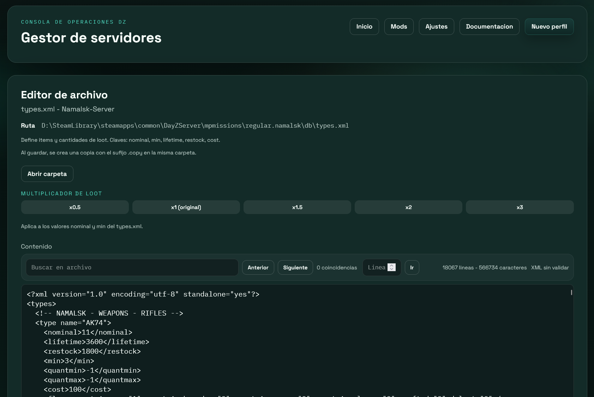
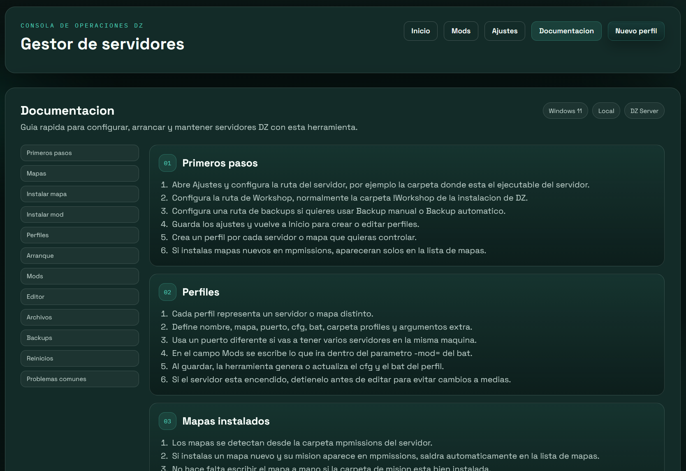
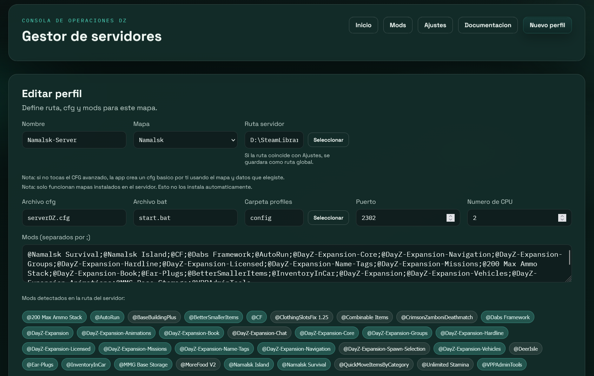
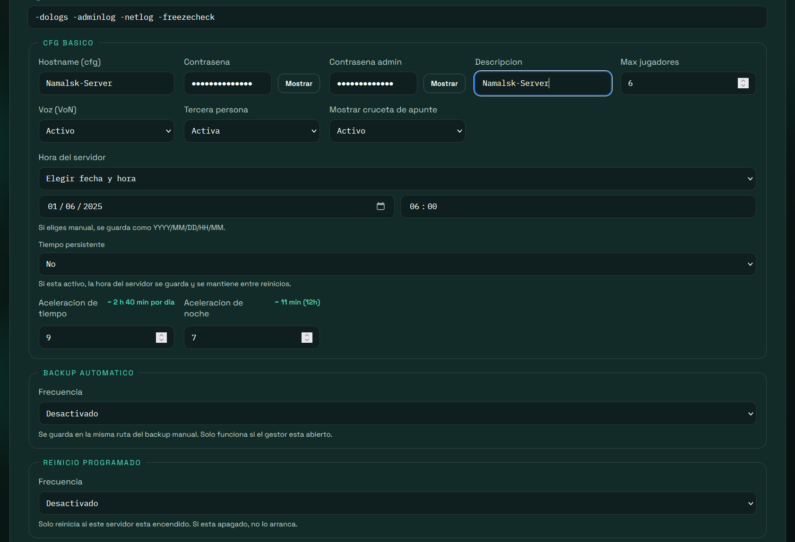

# DZ Server Manager

Aplicacion local para Windows que ayuda a gestionar servidores DZ desde una interfaz web sencilla. Este repositorio publico contiene la version compilada, capturas e instrucciones de uso.

El codigo fuente no se publica en este repositorio.

## Descargar

Version actual:

[Descargar DZServerManager-v1.0.0.zip](downloads/DZServerManager-v1.0.0.zip)

SHA256 del ZIP:

```text
219E49F8305C15ABE742E72A62DD9E9AF1CF0102E7C0B8C01A8E66AAD858F65A
```

El SHA256 es una huella del archivo. Sirve para comprobar que la descarga no se ha corrompido ni modificado.

Para comprobarlo en Windows, abre PowerShell en la carpeta donde descargaste el ZIP y ejecuta:

```powershell
Get-FileHash -Algorithm SHA256 .\DZServerManager-v1.0.0.zip
```

## Capturas

### Inicio



### Mods



### Editor



### Documentacion



### Perfil



### Configuracion avanzada



## Requisitos

- Windows 10 o Windows 11.
- Servidor oficial instalado en el equipo.
- Juego instalado si vas a usar Workshop local.
- Permisos para leer y escribir en la carpeta del servidor.
- Abrir los puertos necesarios en router/firewall si quieres que otras personas entren al servidor.

## Instalar el servidor por primera vez

La herramienta no instala el servidor por ti. Primero necesitas tener el servidor oficial instalado.

Forma sencilla:

1. Abre Steam.
2. En la Biblioteca, cambia el filtro a `Herramientas`.
3. Busca el servidor oficial.
4. Instala la herramienta del servidor.
5. Localiza la carpeta donde se instalo. Normalmente estara dentro de `steamapps\common`.

Tambien puedes instalarlo con SteamCMD si ya trabajas con servidores, pero para empezar es mas simple hacerlo desde Steam.

## Primer arranque de la herramienta

1. Descarga `DZServerManager-v1.0.0.zip`.
2. Extrae el ZIP en una carpeta, por ejemplo en el Escritorio o en `Documentos`.
3. Entra en la carpeta extraida.
4. Ejecuta `DZServerManager.exe`.
5. Si Windows muestra una advertencia, pulsa `Mas informacion` y luego `Ejecutar de todas formas`.
6. Se abrira el navegador en `http://127.0.0.1:5000`.

No necesitas instalar Python. El ZIP ya incluye lo necesario para ejecutar la aplicacion.

## Configuracion inicial

Al abrir la herramienta por primera vez:

1. Entra en `Ajustes`.
2. Configura la ruta del servidor.
3. Configura la ruta del juego.
4. Configura la ruta de Workshop.
5. Configura la ruta de backups si quieres usar una carpeta concreta.
6. Guarda los cambios.

Los datos de la herramienta se guardan en:

```text
%APPDATA%\DZServerManager\servers.json
```

Esto significa que puedes actualizar la aplicacion sin perder perfiles ni rutas.

## Crear el primer perfil

1. Pulsa `Nuevo perfil`.
2. Escribe un nombre para el servidor.
3. Selecciona el mapa.
4. Revisa puerto, CPU, archivo cfg y archivo bat.
5. Guarda.
6. Vuelve a `Inicio`.
7. Pulsa el boton de iniciar del perfil.

Cada perfil genera o actualiza sus archivos de arranque y configuracion.

## Mapas

Los mapas se detectan desde la carpeta `mpmissions` del servidor.

Si instalas un mapa nuevo:

1. Instala o descarga el mapa.
2. Si el mapa es un mod, vinculalo desde `Mods` para crear su carpeta en la raiz del servidor y copiar sus keys.
3. La mision del mapa es otra cosa distinta: debe existir dentro de `mpmissions`.
4. Corta o prepara la carpeta de mision y pegala dentro de `mpmissions`.
5. Vuelve a la herramienta.
6. En `Nuevo perfil` o `Editar perfil`, el mapa aparecera en la lista si la mision esta bien colocada.

Ejemplos de carpetas de mision:

```text
regular.namalsk
empty.deerisle
dayzOffline.enoch
```

## Mods

La pantalla `Mods` sirve para detectar mods de Workshop, crear enlaces en el servidor y copiar keys.

Flujo recomendado:

1. Suscribete o descarga el mod desde Workshop.
2. Abre el juego una vez si hace falta para que Steam descargue el mod.
3. Abre la herramienta y entra en `Mods`.
4. Selecciona el mod.
5. Pulsa para vincularlo.
6. Entra en `Editar perfil`.
7. Anade el nombre del mod al campo `Mods`, separado por punto y coma.
8. Guarda el perfil.

Vincular un mod no significa que el servidor lo cargue automaticamente. Para cargarlo, tambien debe estar escrito en el campo `Mods` del perfil.

## Backups y reinicios

La herramienta permite:

- Backup manual.
- Backup automatico.
- Restaurar backups.
- Reinicio programado cada cierto tiempo.

El reinicio programado no hace nada si el servidor esta apagado.

## Actualizar

Para actualizar:

1. Cierra la herramienta.
2. Descarga la nueva version.
3. Extrae el ZIP nuevo.
4. Ejecuta el nuevo `DZServerManager.exe`.

Tus perfiles se conservan porque estan en `%APPDATA%\DZServerManager`.

## Problemas comunes

Si no aparecen mapas:

- Revisa que la mision exista dentro de `mpmissions`.
- Revisa que la ruta del servidor este bien configurada en `Ajustes`.

Si no aparecen mods:

- Revisa la ruta de Workshop.
- Abre el juego una vez para forzar la descarga del mod.

Si un mod esta vinculado pero no carga:

- Comprueba que tambien esta escrito en el campo `Mods` del perfil.
- Revisa que las dependencias del mod tambien esten anadidas.

Si el servidor no aparece como arrancado:

- Revisa que el puerto no este ocupado.
- Revisa la consola del servidor.
- Comprueba que el perfil apunta al cfg y bat correctos.
